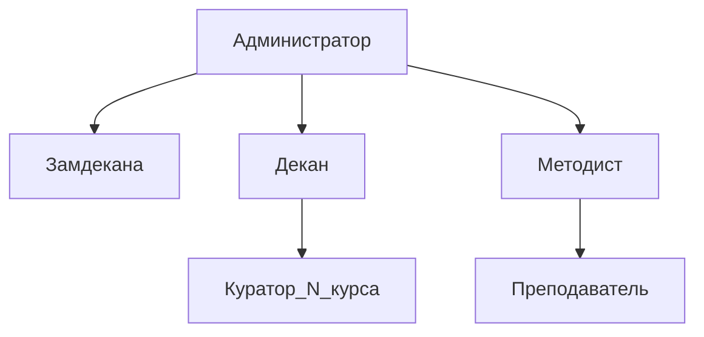

1.	Создайте копию таблицы Предмет. Добавьте в таблицу Предмет атрибуты:
- Признак, входит ли предмет в текущую сессию.
- Отчетность по предмету (экзамен / зачет).
- Курс, на котором преподается предмет.
  **Замечание. В таблице Студент курс определяется, как первая цифра номера группы.

```sql
drop table if exists discipline_plus;  
create table if not exists discipline_plus as select * from discipline;
  

select * from discipline_plus
order by n_discipline;
 

alter table discipline_plus
add is_cur_session bool default false;
  

--drop type type_rep;
create type type_rep as enum('exam', 'test');

  
alter table discipline_plus
add reporting type_rep;


alter table discipline_plus
add course integer;


update discipline_plus dp
set is_cur_session = true
where dp.n_discipline in (1, 4, 6, 7, 9, 11, 13, 15);


update discipline_plus dp
set reporting = 'test'
where dp.n_discipline in (1, 6, 9, 11, 15);

  
update discipline_plus dp
set reporting = 'exam'
where dp.n_discipline in (4, 7, 13);

  

update discipline_plus dp
set course = (
	select LEFT(s.n_group, 1)::INTEGER from student_discipline sd
	join student s on sd.n_credit_book = s.n_credit_book
	where dp.n_discipline = sd.n_discipline
	limit 1
)
where dp.is_cur_session;
```

2. Создайте роли, например: Администратор, Декан, Замдекана, Методист, Преподаватель, Куратор_N_курса.

```sql
create role administrator;

create role dean;

create role deputy_dean;

create role methodologist;

create role teacher;

create role curator_1_course;

create role curator_2_course;

create role curator_3_course;

create role curator_4_course;

create role curator_5_course;

create role curator_6_course;
```

2. Наделите роли привилегиями, например:
- Администратор – все операции для всех таблиц. Создание процедуры*, которая для всех курсов выводит список предметов, вошедших в сессию, и отчетности по этим предметам.

```sql
grant all privileges on all tables in schema public to administrator;
grant create on schema public to administrator;

create user firstadmin;
alter user firstadmin with password '12345678';
grant administrator to firstadmin;

  

-- Выполнить под firstadmin

create or replace procedure current_session()
language plpgsql
AS $$
DECLARE
rec RECORD;
BEGIN
FOR rec IN
	SELECT *
	FROM discipline_plus dp
	WHERE dp.is_cur_session
	LOOP
	
	RAISE NOTICE 'Предмет: % | Преподаватель: % | Отчётность: %',
	rec.title_discipline, rec.second_name_teacher, rec.reporting;
	
END LOOP;

IF NOT FOUND THEN
RAISE NOTICE 'Нет предметов в текущей сессии.';
END IF;
END;
$$;

call current_session();
--
```

-	Декан – выборка из всех таблиц. Выполнение процедуры*.

```sql
grant select on all tables in schema public to dean;

grant usage on schema public to dean;
```
-	Замдекана – выборка из таблиц Студент и Сессия, все операции для таблицы Предмет. Выполнение процедуры*.

```sql
grant select on student, student_discipline to deputy_dean;

grant usage on schema public to deputy_dean;
```
-	Методист – все операции для таблиц Студент и Сессия, выборка для таблицы Предмет тех предметов, которые входят в текущую сессию. Выполнение процедуры*.
```sql
grant all privileges on student, student_discipline to methodologist;

create policy select_current_session_only

on discipline for select to methodologist

using (n_discipline in (

	select n_discipline
	
	from discipline_plus
	
	where is_cur_session

));

grant usage on schema public to methodologist;
```
-	Преподаватель – выборка из таблицы Предмет. Выполнение процедуры*.
```sql
grant select on discipline to teacher;

grant usage on schema public to teacher;
```
-	Куратор_N_курса – выборка сведений о своем курсе для таблиц Студент и Сессия, выборка из таблицы Предмет предметов, которые преподаются на курсе_N. Выполнение процедуры*.

```sql
CREATE OR REPLACE FUNCTION get_student_ids_by_course(p_course INT)

RETURNS SETOF INT

LANGUAGE sql

AS $$

SELECT n_credit_book

FROM student s

WHERE LEFT(s.n_group, 1)::INTEGER = p_course;

$$;

  

create policy select_course_info_student_1 on student

for select to curator_1_course

using (n_credit_book in (select * from get_student_ids_by_course(1)));

  

create policy select_course_info_student_discipline_1 on student_discipline

for select to curator_1_course

using (n_credit_book in (select * from get_student_ids_by_course(1)));

  

create policy select_course_info_discipline_1 on student_discipline

for select to curator_1_course

using (n_discipline in (

select n_discipline

from discipline_plus

where course = 1

));

  

grant usage on schema public to curator_1_course;

  

  

create policy select_course_info_student_2 on student

for select to curator_2_course

using (n_credit_book in (select * from get_student_ids_by_course(2)));

  

create policy select_course_info_student_discipline_2 on student_discipline

for select to curator_2_course

using (n_credit_book in (select * from get_student_ids_by_course(2)));

  

create policy select_course_info_discipline_2 on student_discipline

for select to curator_2_course

using (n_discipline in (

select n_discipline

from discipline_plus

where course = 2

));

  

grant usage on schema public to curator_2_course;

  

  

  

create policy select_course_info_student_3 on student

for select to curator_3_course

using (n_credit_book in (select * from get_student_ids_by_course(3)));

  

create policy select_course_info_student_discipline_3 on student_discipline

for select to curator_3_course

using (n_credit_book in (select * from get_student_ids_by_course(3)));

  

create policy select_course_info_discipline_3 on student_discipline

for select to curator_3_course

using (n_discipline in (

select n_discipline

from discipline_plus

where course = 3

));

  

grant usage on schema public to curator_3_course;

  

  

create policy select_course_info_student_4 on student

for select to curator_4_course

using (n_credit_book in (select * from get_student_ids_by_course(4)));

  

create policy select_course_info_student_discipline_4 on student_discipline

for select to curator_4_course

using (n_credit_book in (select * from get_student_ids_by_course(4)));

  

create policy select_course_info_discipline_4 on student_discipline

for select to curator_4_course

using (n_discipline in (

select n_discipline

from discipline_plus

where course = 4

));

  

  

grant usage on schema public to curator_4_course;

  

  

create policy select_course_info_student_5 on student

for select to curator_5_course

using (n_credit_book in (select * from get_student_ids_by_course(5)));

  

create policy select_course_info_student_discipline_5 on student_discipline

for select to curator_5_course

using (n_credit_book in (select * from get_student_ids_by_course(5)));

  

create policy select_course_info_discipline_5 on student_discipline

for select to curator_5_course

using (n_discipline in (

select n_discipline

from discipline_plus

where course = 5

));

  

grant usage on schema public to curator_5_course;
  

create policy select_course_info_student_6 on student

for select to curator_6_course

using (n_credit_book in (select * from get_student_ids_by_course(6)));

  

create policy select_course_info_student_discipline_6 on student_discipline

for select to curator_6_course

using (n_credit_book in (select * from get_student_ids_by_course(6)));

  

create policy select_course_info_discipline_6 on student_discipline

for select to curator_6_course

using (n_discipline in (

select n_discipline

from discipline_plus

where course = 6

));

  

grant usage on schema public to curator_6_course;
```
3. Постройте матрицу доступа для ролей.
SELECT — S
EXECUTE — X


| Role             | discipline | Course 1 | Course 2 | Course 3 | Course 4 | Course 5 | Course 6 | student | student_discipline | current_session() |
| ---------------- | ---------- | -------- | -------- | -------- | -------- | -------- | -------- | ------- | ------------------ | ----------------- |
| administrator    | ALL        | ALL      | ALL      | ALL      | ALL      | ALL      | ALL      | ALL     | ALL                | ALL               |
| dean             | S          | S        | S        | S        | S        | S        | S        | S       | S                  | X                 |
| deputy_dean      | ALL        | NONE     | NONE     | NONE     | NONE     | NONE     | NONE     | S       | S                  | X                 |
| methodologist    | S          | NONE     | NONE     | NONE     | NONE     | NONE     | NONE     | ALL     | ALL                | X                 |
| curator_1_course | S          | S        | NONE     | NONE     | NONE     | NONE     | NONE     | S       | S                  | X                 |
| curator_2_course | S          | NONE     | S        | NONE     | NONE     | NONE     | NONE     | S       | S                  | X                 |
| curator_3_course | S          | NONE     | NONE     | S        | NONE     | NONE     | NONE     | S       | S                  | X                 |
| curator_4_course | S          | NONE     | NONE     | NONE     | S        | NONE     | NONE     | S       | S                  | X                 |
| curator_5_course | S          | NONE     | NONE     | NONE     | NONE     | S        | NONE     | S       | S                  | X                 |
| curator_6_course | S          | NONE     | NONE     | NONE     | NONE     | NONE     | S        | S       | S                  | X                 |
| teacher          | S          | NONE     | NONE     | NONE     | NONE     | NONE     | NONE     | NONE    | NONE               | X                 |
5. Постройте схему иерархии ролей (графическое изображение).



6. Некоторым ролям верхнего уровня предоставьте роли нижнего уровня.  
    
    выдаем администратору все роли
    ```sql
    tvgudb=# GRANT dean, deputy_dean, methodologist, teacher,
    tvgudb-#       curator_1_course, curator_2_course, curator_3_course,
    tvgudb-#       curator_4_course, curator_5_course, curator_6_course
    tvgudb-# TO administrator;
    GRANT ROLE
    tvgudb=# 
    ```
    выдаем декану роли его подчинённых(кураторов)
    ```sql
    tvgudb=# GRANT curator_1_course, curator_2_course, curator_3_course,
    tvgudb-#       curator_4_course, curator_5_course, curator_6_course
    tvgudb-# TO dean;
    GRANT ROLE
    tvgudb=# 
    ```
    методист получит роль преподавателя
    ```sql
    GRANT teacher TO methodologist;
    ```
7. Покажите привилегии, предоставленные ролям.  
    
    SQL-запрос, отображающий GRANT на таблицы и процедуры, а также RLS-привилегии
    ```sql
        SELECT grantee AS role,
        table_name AS object_name,
        STRING_AGG(privilege_type, ', ') AS privileges,
        'TABLE GRANT' AS type
    FROM information_schema.role_table_grants
    WHERE grantee IN (
        'administrator', 'dean', 'deputy_dean', 'methodologist', 'teacher',
        'curator_1_course', 'curator_2_course', 'curator_3_course',
        'curator_4_course', 'curator_5_course', 'curator_6_course'
    )
    GROUP BY grantee, table_name

    UNION ALL

    SELECT grantee AS role,
        routine_name AS object_name,
        STRING_AGG(privilege_type, ', ') AS privileges,
        'PROCEDURE GRANT' AS type
    FROM information_schema.role_routine_grants
    WHERE grantee IN (
        'administrator', 'dean', 'deputy_dean', 'methodologist', 'teacher',
        'curator_1_course', 'curator_2_course', 'curator_3_course',
        'curator_4_course', 'curator_5_course', 'curator_6_course'
    )
    GROUP BY grantee, routine_name

    UNION ALL

    SELECT unnest(roles) AS role,
        tablename AS object_name,
        cmd AS privileges,
        'RLS' AS type
    FROM pg_policies
    WHERE roles && ARRAY[
        'curator_1_course', 'curator_2_course', 'curator_3_course',
        'curator_4_course', 'curator_5_course', 'curator_6_course'
    ]::name[]
    ORDER BY role, object_name;
    ```
    таблица привилегий
    ```sql
           role       |    object_name     |                          privileges                           |      type       
    ------------------+--------------------+---------------------------------------------------------------+-----------------
    administrator    | alembic_version    | INSERT, TRIGGER, SELECT, UPDATE, DELETE, TRUNCATE, REFERENCES | TABLE GRANT
    administrator    | current_session    | EXECUTE                                                       | PROCEDURE GRANT
    administrator    | discipline         | INSERT, SELECT, UPDATE, DELETE, TRUNCATE, REFERENCES, TRIGGER | TABLE GRANT
    administrator    | discipline_plus    | REFERENCES, SELECT, UPDATE, DELETE, TRUNCATE, TRIGGER, INSERT | TABLE GRANT
    administrator    | student            | TRIGGER, TRUNCATE, DELETE, UPDATE, SELECT, INSERT, REFERENCES | TABLE GRANT
    administrator    | student_discipline | UPDATE, TRUNCATE, REFERENCES, TRIGGER, INSERT, SELECT, DELETE | TABLE GRANT
    administrator    | v_titles           | INSERT, TRIGGER, REFERENCES, TRUNCATE, DELETE, UPDATE, SELECT | TABLE GRANT
    curator_1_course | current_session    | EXECUTE                                                       | PROCEDURE GRANT
    curator_1_course | student            | SELECT                                                        | RLS
    curator_1_course | student_discipline | SELECT                                                        | RLS
    curator_1_course | student_discipline | SELECT                                                        | RLS
    curator_2_course | current_session    | EXECUTE                                                       | PROCEDURE GRANT
    curator_2_course | student            | SELECT                                                        | RLS
    curator_2_course | student_discipline | SELECT                                                        | RLS
    curator_2_course | student_discipline | SELECT                                                        | RLS
    curator_3_course | current_session    | EXECUTE                                                       | PROCEDURE GRANT
    curator_3_course | student            | SELECT                                                        | RLS
    curator_3_course | student_discipline | SELECT                                                        | RLS
    curator_3_course | student_discipline | SELECT                                                        | RLS
    curator_4_course | current_session    | EXECUTE                                                       | PROCEDURE GRANT
    curator_4_course | student            | SELECT                                                        | RLS
    curator_4_course | student_discipline | SELECT                                                        | RLS
    curator_4_course | student_discipline | SELECT                                                        | RLS
    curator_5_course | current_session    | EXECUTE                                                       | PROCEDURE GRANT
    curator_5_course | student            | SELECT                                                        | RLS
    curator_5_course | student_discipline | SELECT                                                        | RLS
    curator_5_course | student_discipline | SELECT                                                        | RLS
    curator_6_course | current_session    | EXECUTE                                                       | PROCEDURE GRANT
    curator_6_course | student            | SELECT                                                        | RLS
    curator_6_course | student_discipline | SELECT                                                        | RLS
    curator_6_course | student_discipline | SELECT                                                        | RLS
    dean             | alembic_version    | SELECT                                                        | TABLE GRANT
    dean             | current_session    | EXECUTE                                                       | PROCEDURE GRANT
    dean             | discipline         | SELECT                                                        | TABLE GRANT
    dean             | discipline_plus    | SELECT                                                        | TABLE GRANT
    dean             | student            | SELECT                                                        | TABLE GRANT
    dean             | student_discipline | SELECT                                                        | TABLE GRANT
    dean             | v_titles           | SELECT                                                        | TABLE GRANT
    deputy_dean      | current_session    | EXECUTE                                                       | PROCEDURE GRANT
    deputy_dean      | student            | SELECT                                                        | TABLE GRANT
    deputy_dean      | student_discipline | SELECT                                                        | TABLE GRANT
    methodologist    | current_session    | EXECUTE                                                       | PROCEDURE GRANT
    methodologist    | student            | TRUNCATE, TRIGGER, REFERENCES, DELETE, UPDATE, SELECT, INSERT | TABLE GRANT
    methodologist    | student_discipline | TRIGGER, REFERENCES, INSERT, TRUNCATE, DELETE, UPDATE, SELECT | TABLE GRANT
    teacher          | current_session    | EXECUTE                                                       | PROCEDURE GRANT
    teacher          | discipline         | SELECT                                                        | TABLE GRANT
    (46 rows)
            
    tvgudb=# 

    ```

8. Создайте пользователей.  
    ```sql
    tvgudb=# CREATE USER dean_user WITH PASSWORD '1234';
    CREATE ROLE
    tvgudb=# CREATE USER deputy_dean_user WITH PASSWORD '1234';
    CREATE ROLE
    tvgudb=# CREATE USER methodologist_user WITH PASSWORD '1234';
    CREATE ROLE
    tvgudb=# CREATE USER teacher_user WITH PASSWORD '1234';
    CREATE ROLE
    tvgudb=# CREATE USER curator1_user WITH PASSWORD '1234';
    CREATE ROLE
    tvgudb=# CREATE USER curator2_user WITH PASSWORD '1234';
    CREATE ROLE
    tvgudb=# CREATE USER curator3_user WITH PASSWORD '1234';
    CREATE ROLE
    tvgudb=# CREATE USER curator4_user WITH PASSWORD '1234';
    CREATE ROLE
    tvgudb=# CREATE USER curator5_user WITH PASSWORD '1234';
    CREATE ROLE
    tvgudb=# CREATE USER curator6_user WITH PASSWORD '1234';
    CREATE ROLE
    tvgudb=#
    ```

9. Предоставьте роли пользователям.  
    ```sql
    tvgudb=# GRANT dean TO dean_user;
    GRANT ROLE
    tvgudb=# GRANT deputy_dean TO deputy_dean_user;
    GRANT ROLE
    tvgudb=# GRANT methodologist TO methodologist_user;
    GRANT ROLE
    tvgudb=# GRANT teacher TO teacher_user;
    GRANT ROLE
    tvgudb=# GRANT curator_1_course TO curator1_user;
    GRANT ROLE
    tvgudb=# GRANT curator_2_course TO curator2_user;
    GRANT ROLE
    tvgudb=# GRANT curator_3_course TO curator3_user;
    GRANT ROLE
    tvgudb=# GRANT curator_4_course TO curator4_user;
    GRANT ROLE
    tvgudb=# GRANT curator_5_course TO curator5_user;
    GRANT ROLE
    tvgudb=# GRANT curator_6_course TO curator6_user;
    GRANT ROLE
    tvgudb=#
    ```
10. Покажите роли, предоставленные пользователям.  

    SQL-запрос, отображающий пользователей и их роли

    ```sql
    SELECT u.rolname AS user_name,
       r.rolname AS role_name
    FROM pg_roles u
    JOIN pg_auth_members m ON m.member = u.oid
    JOIN pg_roles r ON r.oid = m.roleid
    WHERE u.rolname IN (
        'firstadmin', 'dean_user', 'deputy_dean_user', 'methodologist_user', 'teacher_user',
        'curator1_user', 'curator2_user', 'curator3_user',
        'curator4_user', 'curator5_user', 'curator6_user'
    )
    ORDER BY u.rolname;
    ```
	вывод 
	```sql
	     user_name      |    role_name     
	--------------------+------------------
	curator1_user      | curator_1_course
	curator2_user      | curator_2_course
	curator3_user      | curator_3_course
	curator4_user      | curator_4_course
	curator5_user      | curator_5_course
	curator6_user      | curator_6_course
	deputy_dean_user   | deputy_dean
	firstadmin         | administrator
	methodologist_user | methodologist
	teacher_user       | teacher
	(10 rows)

	tvgudb=# 
	```

11. Предоставьте одному из пользователей напрямую одну из привилегий, предоставляемую ему ролью.

    выдаём пользователю dean_user напрямую право вызывать процедуру и отбираем роль
    ```sql
    tvgudb=# GRANT EXECUTE ON PROCEDURE current_session() TO dean_user;
    GRANT
    tvgudb=# REVOKE dean FROM dean_user;
    REVOKE ROLE
    tvgudb=#
    ```
    проверяем пожет ли пользователь вызвать процедуру
    ```sql
    tvgudb=# \c tvgudb dean_user
    You are now connected to database "tvgudb" as user "dean_user".
    tvgudb=> CALL current_session();
    ERROR:  permission denied for table discipline_plus
    CONTEXT:  SQL statement "SELECT *
    FROM discipline_plus dp
    WHERE dp.is_cur_session"
    PL/pgSQL function current_session() line 5 at FOR over SELECT rows
    ```
    ничего не вышло так как право на вызов процедуры есть, а на SELECT таблицы discipline_plus нет  
    выдадим SELECT на эту таблицу  

    ```sql
	tvgudb=# GRANT SELECT ON discipline_plus TO dean_user;
    GRANT
    tvgudb=# \c tvgudb dean_user
    You are now connected to database "tvgudb" as user "dean_user".
    tvgudb=>  CALL current_session();
    NOTICE:  Предмет: Математика | Преподаватель: Смирнов | Отчётность: test
    NOTICE:  Предмет: Литература | Преподаватель: Петров | Отчётность: test
    NOTICE:  Предмет: Информатика | Преподаватель: Смирнов | Отчётность: test
    NOTICE:  Предмет: Математика | Преподаватель: Казаков | Отчётность: test
    NOTICE:  Предмет: Английский | Преподаватель: Коновалов | Отчётность: test
    NOTICE:  Предмет: Химия | Преподаватель: Смирнов | Отчётность: exam
    NOTICE:  Предмет: История | Преподаватель: Сидорова | Отчётность: exam
    NOTICE:  Предмет: Информатика | Преподаватель: Коновалов | Отчётность: exam
    CALL
    tvgudb=> 
    ```

12.

```sql
DO $$
BEGIN
  IF NOT EXISTS (SELECT 1 FROM pg_roles WHERE rolname = 'u_dean') THEN
CREATE ROLE u_dean LOGIN PASSWORD 'u_dean_pw';
END IF;
  IF NOT EXISTS (SELECT 1 FROM pg_roles WHERE rolname = 'u_deputy') THEN
CREATE ROLE u_deputy LOGIN PASSWORD 'u_deputy_pw';
END IF;
  IF NOT EXISTS (SELECT 1 FROM pg_roles WHERE rolname = 'u_methodologist') THEN
CREATE ROLE u_methodologist LOGIN PASSWORD 'u_methodologist_pw';
END IF;
  IF NOT EXISTS (SELECT 1 FROM pg_roles WHERE rolname = 'u_teacher') THEN
CREATE ROLE u_teacher LOGIN PASSWORD 'u_teacher_pw';
END IF;
  IF NOT EXISTS (SELECT 1 FROM pg_roles WHERE rolname = 'u_curator1') THEN
CREATE ROLE u_curator1 LOGIN PASSWORD 'u_curator1_pw';
END IF;
  IF NOT EXISTS (SELECT 1 FROM pg_roles WHERE rolname = 'u_teacher_direct') THEN
CREATE ROLE u_teacher_direct LOGIN PASSWORD 'u_teacher_direct_pw';
END IF;
END$$;

GRANT dean              TO u_dean;
GRANT deputy_dean       TO u_deputy;
GRANT methodologist     TO u_methodologist;
GRANT teacher           TO u_teacher;
GRANT curator_1_course  TO u_curator1;
GRANT teacher           TO u_teacher_direct;
```

Проверка ролей
```sql
SELECT member.rolname AS user_name,
       role.rolname   AS role_name
FROM pg_auth_members m
         JOIN pg_roles role   ON role.oid   = m.roleid
         JOIN pg_roles member ON member.oid = m.member
WHERE member.rolname IN (
                         'u_dean','u_deputy','u_methodologist','u_teacher','u_curator1','u_teacher_direct'
    )
ORDER BY user_name, role_name;
```

Вывод:

| user\_name | role\_name |
| :--- | :--- |
| u\_curator1 | curator\_1\_course |
| u\_dean | dean |
| u\_deputy | deputy\_dean |
| u\_methodologist | methodologist |
| u\_teacher | teacher |
| u\_teacher\_direct | teacher |


12.A  

```bash
[2025-11-12 09:14:07] tvgudb.public> SET ROLE dean
[2025-11-12 09:14:07] completed in 5 ms
```

```sql
SELECT current_user AS acting_as_dean,
has_table_privilege(current_user,'public.student','SELECT') AS can_select_student,
has_table_privilege(current_user,'public.student_discipline','SELECT') AS can_select_student_disc,
has_table_privilege(current_user,'public.discipline','SELECT') AS can_select_discipline;
```

| acting\_as\_dean | can\_select\_student | can\_select\_student\_disc | can\_select\_discipline |
| :--- | :--- | :--- | :--- |
| dean | true | true | true |


```bash
[2025-11-12 09:14:11] tvgudb.public> CALL current_session()
Предмет: Математика | Преподаватель: Смирнов | Отчётность: test
Предмет: Литература | Преподаватель: Петров | Отчётность: test
Предмет: Информатика | Преподаватель: Смирнов | Отчётность: test
Предмет: Математика | Преподаватель: Казаков | Отчётность: test
Предмет: Английский | Преподаватель: Коновалов | Отчётность: test
Предмет: Химия | Преподаватель: Смирнов | Отчётность: exam
Предмет: История | Преподаватель: Сидорова | Отчётность: exam
Предмет: Информатика | Преподаватель: Коновалов | Отчётность: exam
[2025-11-12 09:14:11] completed in 6 ms
```

12.B

```bash
[2025-11-12 09:22:27] tvgudb.public> SET ROLE deputy_dean
[2025-11-12 09:22:27] completed in 14 ms
```

```sql
SELECT current_user AS acting_as_deputy,
       has_table_privilege(current_user,'public.student','SELECT') AS can_select_student,
       has_table_privilege(current_user,'public.student_discipline','SELECT') AS can_select_student_disc,
       has_table_privilege(current_user,'public.discipline','SELECT') AS can_select_disc,
       has_table_privilege(current_user,'public.discipline','INSERT') AS can_insert_disc,
       has_table_privilege(current_user,'public.discipline','UPDATE') AS can_update_disc,
       has_table_privilege(current_user,'public.discipline','DELETE') AS can_delete_disc;
```

| acting\_as\_deputy | can\_select\_student | can\_select\_student\_disc | can\_select\_disc | can\_insert\_disc | can\_update\_disc | can\_delete\_disc |
| :--- | :--- | :--- | :--- | :--- | :--- | :--- |
| deputy\_dean | true | true | false | false | false | false |

```bash
[2025-11-12 09:27:53] tvgudb.public> CALL current_session()
[2025-11-12 09:27:53] [42501] ERROR: permission denied for table discipline_plus
[2025-11-12 09:27:53] Where: SQL statement "SELECT *
[2025-11-12 09:27:53] FROM discipline_plus dp
[2025-11-12 09:27:53] WHERE dp.is_cur_session"
[2025-11-12 09:27:53] PL/pgSQL function current_session() line 5 at FOR over SELECT rows
```

12.C

```bash
[2025-11-12 09:48:11] tvgudb.public> SET ROLE methodologist
[2025-11-12 09:48:11] completed in 3 ms
```

```sql
SELECT current_user AS acting_as_methodologist,
       has_table_privilege(current_user,'public.student','SELECT') AS can_select_student,
       has_table_privilege(current_user,'public.student','INSERT') AS can_insert_student,
       has_table_privilege(current_user,'public.student','UPDATE') AS can_update_student,
       has_table_privilege(current_user,'public.student','DELETE') AS can_delete_student,
       has_table_privilege(current_user,'public.student_discipline','SELECT') AS can_select_student_disc,
       has_table_privilege(current_user,'public.discipline','SELECT') AS can_select_discipline;
```

| acting\_as\_methodologist | can\_select\_student | can\_insert\_student | can\_update\_student | can\_delete\_student | can\_select\_student\_disc | can\_select\_discipline |
| :--- | :--- | :--- | :--- | :--- | :--- | :--- |
| methodologist | true | true | true | true | true | false |


```bash
[2025-11-12 09:49:29] tvgudb.public> SELECT n_discipline, title_discipline, second_name_teacher
                                     FROM discipline
                                     ORDER BY n_discipline
                                         LIMIT 10
[2025-11-12 09:49:29] [42501] ERROR: permission denied for table discipline
```

```bash
[2025-11-12 09:50:51] tvgudb.public> CALL current_session()
[2025-11-12 09:50:51] [42501] ERROR: permission denied for table discipline_plus
[2025-11-12 09:50:51] Where: SQL statement "SELECT *
[2025-11-12 09:50:51] FROM discipline_plus dp
[2025-11-12 09:50:51] WHERE dp.is_cur_session"
[2025-11-12 09:50:51] PL/pgSQL function current_session() line 5 at FOR over SELECT rows
```

12.D

```bash
[2025-11-12 09:51:13] tvgudb.public> SET ROLE teacher
[2025-11-12 09:51:13] completed in 6 ms
```

```sql
SELECT current_user AS acting_as_teacher,
       has_table_privilege(current_user,'public.discipline','SELECT') AS can_select_discipline;
```

| acting\_as\_teacher | can\_select\_discipline |
| :--- | :--- |
| teacher | true |

```bash
[2025-11-12 09:51:22] tvgudb.public> CALL current_session()
[2025-11-12 09:51:22] [42501] ERROR: permission denied for table discipline_plus
[2025-11-12 09:51:22] Where: SQL statement "SELECT *
[2025-11-12 09:51:22] FROM discipline_plus dp
[2025-11-12 09:51:22] WHERE dp.is_cur_session"
[2025-11-12 09:51:22] PL/pgSQL function current_session() line 5 at FOR over SELECT rows
```

12.E

```bash
[2025-11-12 09:53:12] tvgudb.public> SET ROLE curator_1_course
[2025-11-12 09:53:12] completed in 6 ms
```

```bash
[2025-11-12 09:53:31] tvgudb.public> SELECT 'student_rows_visible' AS check_name, COUNT(*) AS rows_visible FROM student
[2025-11-12 09:53:31] [42501] ERROR: permission denied for table student
```

```bash
[2025-11-12 09:54:55] tvgudb.public> SELECT 'student_discipline_rows_visible' AS check_name, COUNT(*) AS rows_visible FROM student_discipline
[2025-11-12 09:54:55] [42501] ERROR: permission denied for table student_discipline
```

```sql
SELECT current_user AS acting_as_curator1,
       has_table_privilege(current_user,'public.student','SELECT') AS can_select_student,
       has_table_privilege(current_user,'public.student_discipline','SELECT') AS can_select_student_disc;
```

| acting\_as\_curator1 | can\_select\_student | can\_select\_student\_disc |
| :--- | :--- | :--- |
| curator\_1\_course | false | false |

```bash
[2025-11-12 09:55:52] tvgudb.public> CALL current_session()
[2025-11-12 09:55:52] [42501] ERROR: permission denied for table discipline_plus
[2025-11-12 09:55:52] Where: SQL statement "SELECT *
[2025-11-12 09:55:52] FROM discipline_plus dp
[2025-11-12 09:55:52] WHERE dp.is_cur_session"
[2025-11-12 09:55:52] PL/pgSQL function current_session() line 5 at FOR over SELECT rows
```

12.F

```sql
GRANT SELECT ON public.discipline TO u_teacher_direct;
SELECT 'before_revokes' AS phase,
       pg_has_role('u_teacher_direct','teacher','USAGE') AS is_member_of_teacher,
       has_table_privilege('u_teacher_direct','public.discipline','SELECT') AS user_can_select_discipline;
```

| phase | is\_member\_of\_teacher | user\_can\_select\_discipline |
| :--- | :--- | :--- |
| before\_revokes | true | true |

```sql
REVOKE SELECT ON public.discipline FROM u_teacher_direct;
SELECT 'after_revoke_direct' AS phase,
       pg_has_role('u_teacher_direct','teacher','USAGE') AS is_member_of_teacher,
       has_table_privilege('u_teacher_direct','public.discipline','SELECT') AS user_can_select_discipline;
```

| phase | is\_member\_of\_teacher | user\_can\_select\_discipline |
| :--- | :--- | :--- |
| after\_revoke\_direct | true | true |

```sql
GRANT SELECT ON public.discipline TO u_teacher_direct;
REVOKE SELECT ON public.discipline FROM teacher;
SELECT 'after_revoke_from_role' AS phase,
       pg_has_role('u_teacher_direct','teacher','USAGE') AS is_member_of_teacher,
       has_table_privilege('u_teacher_direct','public.discipline','SELECT') AS user_can_select_discipline;
```

| phase | is\_member\_of\_teacher | user\_can\_select\_discipline |
| :--- | :--- | :--- |
| after\_revoke\_from\_role | true | true |


```sql
GRANT SELECT ON public.discipline TO teacher;
REVOKE SELECT ON public.discipline FROM u_teacher_direct;
```

12.G
```sql
GRANT curator_1_course TO u_teacher;
SELECT grantee AS user_name, role_name
FROM information_schema.applicable_roles
WHERE grantee = 'u_teacher'
ORDER BY role_name;
```

| user\_name | role\_name |
| :--- | :--- |
| u\_teacher | curator\_1\_course |
| u\_teacher | teacher |

```bash
[2025-11-12 10:01:09] tvgudb.public> SET ROLE curator_1_course
[2025-11-12 10:01:09] completed in 5 ms
[2025-11-12 10:01:11] tvgudb.public> SELECT current_user AS acting_as_after_role_switch,
                                            (SELECT COUNT(*) FROM student) AS rows_student_visible_under_curator_role
[2025-11-12 10:01:11] [42501] ERROR: permission denied for table student
```

```bash
[2025-11-12 10:01:34] tvgudb.public> RESET ROLE
[2025-11-12 10:01:34] completed in 3 ms
```

13-16
```sql
REVOKE dean              FROM u_dean;
REVOKE deputy_dean       FROM u_deputy;
REVOKE methodologist     FROM u_methodologist;
REVOKE teacher           FROM u_teacher;
REVOKE curator_1_course  FROM u_curator1;
REVOKE teacher           FROM u_teacher_direct;
REVOKE curator_1_course  FROM u_teacher;
REVOKE ALL PRIVILEGES ON public.discipline FROM u_teacher_direct;

DO $$
BEGIN
  IF EXISTS (SELECT 1 FROM pg_roles WHERE rolname = 'u_dean') THEN
DROP ROLE u_dean;
END IF;
  IF EXISTS (SELECT 1 FROM pg_roles WHERE rolname = 'u_deputy') THEN
DROP ROLE u_deputy;
END IF;
  IF EXISTS (SELECT 1 FROM pg_roles WHERE rolname = 'u_methodologist') THEN
DROP ROLE u_methodologist;
END IF;
  IF EXISTS (SELECT 1 FROM pg_roles WHERE rolname = 'u_teacher') THEN
DROP ROLE u_teacher;
END IF;
  IF EXISTS (SELECT 1 FROM pg_roles WHERE rolname = 'u_curator1') THEN
DROP ROLE u_curator1;
END IF;
  IF EXISTS (SELECT 1 FROM pg_roles WHERE rolname = 'u_teacher_direct') THEN
DROP ROLE u_teacher_direct;
END IF;
END$$;
```