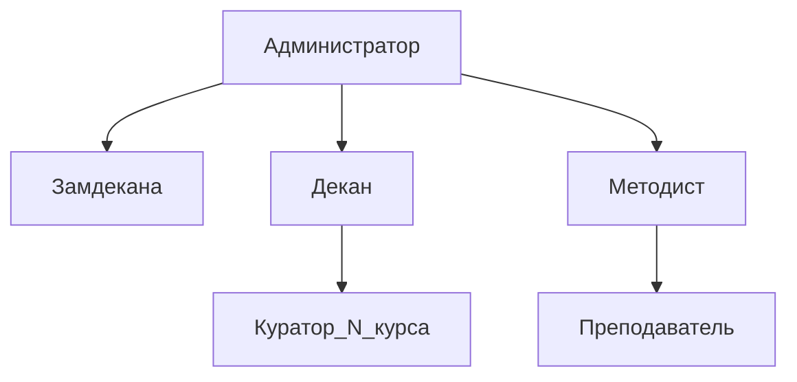

1.	Создайте копию таблицы Предмет. Добавьте в таблицу Предмет атрибуты:
- Признак, входит ли предмет в текущую сессию.
- Отчетность по предмету (экзамен / зачет).
- Курс, на котором преподается предмет.
  **Замечание. В таблице Студент курс определяется, как первая цифра номера группы.

```sql
drop table if exists discipline_plus;
create table if not exists discipline_plus as select * from discipline;


select * from discipline_plus
order by n_discipline;


alter table discipline_plus
add is_cur_session bool default false;


--drop type type_rep;
create type type_rep as enum('exam', 'test');


alter table discipline_plus
add reporting type_rep;


alter table discipline_plus
add course integer;


update discipline_plus dp
set is_cur_session = true
where dp.n_discipline in (1, 4, 6, 7, 9, 11, 13, 15);


update discipline_plus dp
set reporting = 'test'
where dp.n_discipline in (1, 6, 9, 11, 15);


update discipline_plus dp
set reporting = 'exam'
where dp.n_discipline in (4, 7, 13);


update discipline_plus dp
set course = (
	select LEFT(s.n_group, 1)::INTEGER from student_discipline sd
	join student s on sd.n_credit_book = s.n_credit_book
	where dp.n_discipline = sd.n_discipline
	limit 1
)
where dp.is_cur_session;
```

2. Создайте роли, например: Администратор, Декан, Замдекана, Методист, Преподаватель, Куратор_N_курса.

```sql
create role administrator;

create role dean;

create role deputy_dean;

create role methodologist;

create role teacher;

create role curator_1_course;

create role curator_2_course;

create role curator_3_course;

create role curator_4_course;

create role curator_5_course;

create role curator_6_course;
```

2. Наделите роли привилегиями, например:
- Администратор – все операции для всех таблиц. Создание процедуры*, которая для всех курсов выводит список предметов, вошедших в сессию, и отчетности по этим предметам.

```sql
grant all privileges on all tables in schema public to administrator;
grant create on schema public to administrator;

create user firstadmin;
alter user firstadmin with password '12345678';
grant administrator to firstadmin;


-- Выполнить под firstadmin

create or replace procedure current_session()
language plpgsql
AS $$
DECLARE
rec RECORD;
BEGIN
FOR rec IN
	SELECT *
	FROM discipline_plus dp
	WHERE dp.is_cur_session
	LOOP

	RAISE NOTICE 'Предмет: % | Преподаватель: % | Отчётность: %',
	rec.title_discipline, rec.second_name_teacher, rec.reporting;

END LOOP;

IF NOT FOUND THEN
RAISE NOTICE 'Нет предметов в текущей сессии.';
END IF;
END;
$$;

call current_session();
--
```

-	Декан – выборка из всех таблиц. Выполнение процедуры*.

```sql
grant select on all tables in schema public to dean;

grant execute on procedure current_session() public to dean;
```
-	Замдекана – выборка из таблиц Студент и Сессия, все операции для таблицы Предмет. Выполнение процедуры*.

```sql
grant select on student, student_discipline to deputy_dean;

grant execute on procedure current_session() to deputy_dean;
```
-	Методист – все операции для таблиц Студент и Сессия, выборка для таблицы Предмет тех предметов, которые входят в текущую сессию. Выполнение процедуры*.
```sql
grant all privileges on student, student_discipline to methodologist;

create policy select_current_session_only

on discipline for select to methodologist

using (n_discipline in (

	select n_discipline

	from discipline_plus

	where is_cur_session

));

grant execute on procedure current_session() to methodologist;
```
-	Преподаватель – выборка из таблицы Предмет. Выполнение процедуры*.
```sql
grant select on discipline to teacher;

grant execute on procedure current_session() to teacher;
```
-	Куратор_N_курса – выборка сведений о своем курсе для таблиц Студент и Сессия, выборка из таблицы Предмет предметов, которые преподаются на курсе_N. Выполнение процедуры*.

```sql
CREATE OR REPLACE FUNCTION get_student_ids_by_course(p_course INT)

RETURNS SETOF INT

LANGUAGE sql

AS $$

SELECT n_credit_book

FROM student s

WHERE LEFT(s.n_group, 1)::INTEGER = p_course;

$$;


create policy select_course_info_student_1 on student

for select to curator_1_course

using (n_credit_book in (select * from get_student_ids_by_course(1)));


create policy select_course_info_student_discipline_1 on student_discipline

for select to curator_1_course

using (n_credit_book in (select * from get_student_ids_by_course(1)));


create policy select_course_info_discipline_1 on student_discipline

for select to curator_1_course

using (n_discipline in (

select n_discipline

from discipline_plus

where course = 1

));


grant execute on procedure current_session() to curator_1_course;


create policy select_course_info_student_2 on student

for select to curator_2_course

using (n_credit_book in (select * from get_student_ids_by_course(2)));


create policy select_course_info_student_discipline_2 on student_discipline

for select to curator_2_course

using (n_credit_book in (select * from get_student_ids_by_course(2)));


create policy select_course_info_discipline_2 on student_discipline

for select to curator_2_course

using (n_discipline in (

select n_discipline

from discipline_plus

where course = 2

));


grant execute on procedure current_session() to curator_2_course;


create policy select_course_info_student_3 on student

for select to curator_3_course

using (n_credit_book in (select * from get_student_ids_by_course(3)));


create policy select_course_info_student_discipline_3 on student_discipline

for select to curator_3_course

using (n_credit_book in (select * from get_student_ids_by_course(3)));


create policy select_course_info_discipline_3 on student_discipline

for select to curator_3_course

using (n_discipline in (

select n_discipline

from discipline_plus

where course = 3

));


grant execute on procedure current_session() to curator_3_course;


create policy select_course_info_student_4 on student

for select to curator_4_course

using (n_credit_book in (select * from get_student_ids_by_course(4)));


create policy select_course_info_student_discipline_4 on student_discipline

for select to curator_4_course

using (n_credit_book in (select * from get_student_ids_by_course(4)));


create policy select_course_info_discipline_4 on student_discipline

for select to curator_4_course

using (n_discipline in (

select n_discipline

from discipline_plus

where course = 4

));


grant execute on procedure current_session() to curator_4_course;


create policy select_course_info_student_5 on student

for select to curator_5_course

using (n_credit_book in (select * from get_student_ids_by_course(5)));


create policy select_course_info_student_discipline_5 on student_discipline

for select to curator_5_course

using (n_credit_book in (select * from get_student_ids_by_course(5)));


create policy select_course_info_discipline_5 on student_discipline

for select to curator_5_course

using (n_discipline in (

select n_discipline

from discipline_plus

where course = 5

));


grant execute on procedure current_session() to curator_5_course;


create policy select_course_info_student_6 on student

for select to curator_6_course

using (n_credit_book in (select * from get_student_ids_by_course(6)));


create policy select_course_info_student_discipline_6 on student_discipline

for select to curator_6_course

using (n_credit_book in (select * from get_student_ids_by_course(6)));


create policy select_course_info_discipline_6 on student_discipline

for select to curator_6_course

using (n_discipline in (

select n_discipline

from discipline_plus

where course = 6

));


grant execute on procedure current_session() to curator_6_course;
```
3. Постройте матрицу доступа для ролей.
SELECT — S
EXECUTE — X


| Role             | discipline | Course 1 | Course 2 | Course 3 | Course 4 | Course 5 | Course 6 | student | student_discipline | current_session() |
| ---------------- | ---------- | -------- | -------- | -------- | -------- | -------- | -------- | ------- | ------------------ | ----------------- |
| administrator    | ALL        | ALL      | ALL      | ALL      | ALL      | ALL      | ALL      | ALL     | ALL                | ALL               |
| dean             | S          | S        | S        | S        | S        | S        | S        | S       | S                  | X                 |
| deputy_dean      | ALL        | NONE     | NONE     | NONE     | NONE     | NONE     | NONE     | S       | S                  | X                 |
| methodologist    | S          | NONE     | NONE     | NONE     | NONE     | NONE     | NONE     | ALL     | ALL                | X                 |
| curator_1_course | S          | S        | NONE     | NONE     | NONE     | NONE     | NONE     | S       | S                  | X                 |
| curator_2_course | S          | NONE     | S        | NONE     | NONE     | NONE     | NONE     | S       | S                  | X                 |
| curator_3_course | S          | NONE     | NONE     | S        | NONE     | NONE     | NONE     | S       | S                  | X                 |
| curator_4_course | S          | NONE     | NONE     | NONE     | S        | NONE     | NONE     | S       | S                  | X                 |
| curator_5_course | S          | NONE     | NONE     | NONE     | NONE     | S        | NONE     | S       | S                  | X                 |
| curator_6_course | S          | NONE     | NONE     | NONE     | NONE     | NONE     | S        | S       | S                  | X                 |
| teacher          | S          | NONE     | NONE     | NONE     | NONE     | NONE     | NONE     | NONE    | NONE               | X                 |
5. Постройте схему иерархии ролей (графическое изображение).

